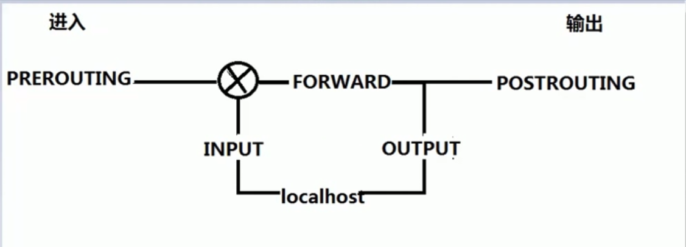

# iptables

## 数据包流向总揽

## netfilter

linux内核通过netfilter模块实现网络访问控制功能，在用户层可以通过iptables程序对netfilter进行管理。

netfilter可以对数据包进行允许、丢弃、修改操作。

netfilter通过以下方式对数据包进行分类：


* 源IP地址
* 目标IP地址
* 使用接口
* 使用协议（TCP、UDP、ICMP等）
* 端口号
* 连接状态（new、ESTABLISHED、RELATED、INVALID）


