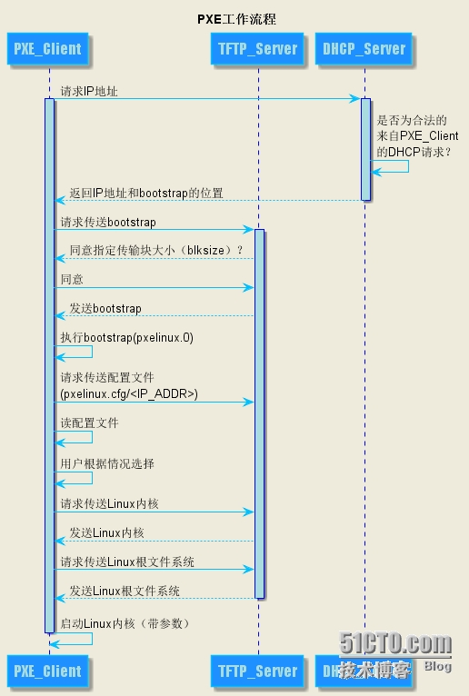

# 安装操作系统

## 参考

1. [Setting up a ‘PXE Network Boot Server’ for Multiple Linux Distribution Installations in RHEL/CentOS 7](https://www.tecmint.com/install-pxe-network-boot-server-in-centos-7/)
2. [Automated Installations of Multiple RHEL/CentOS 7 Distributions using PXE Server and Kickstart Files](https://www.tecmint.com/multiple-centos-installations-using-kickstart/)
3. [PXE工作原理（有图有真相）](http://blog.51cto.com/lavenliu/1629922)
4. [DHCP Option 常见取值及含义](http://blog.csdn.net/nosodeep/article/details/45971677)
5. [DNSmasq – 配置DNS和DHCP](http://debugo.com/dnsmasq/)
6. [DNSmasq – 配置PXE](http://debugo.com/dnsmasq-pxe/)
7. [DHCP原理及配置](http://blog.51cto.com/minux/1714849)
8. [DHCP 详解](https://www.cnblogs.com/happygirl-zjj/p/5976526.html)

## 设置 PXE Network Boot Server

### 工作原理



### 工具

1. DNSMASQ: 提供DNS, DHCP, TFTP服务.
2. Syslinux: 提供bootloader.
3. VSFTPD: 托管本地挂载的DVD镜像.

### 步骤

#### DNSMASQ服务器

```bash
# 安装dnsmasq
yum install dnsmasq
```

```bash
# etc/dnsmasq.conf内容

# 只监听enp0s8网卡
interface enp0s8
# 不考虑通配符
bind-interfaces 

# DHCP range-leases
dhcp-range = 192.168.57.100,192.168.57.200,255.255.255.0, 1h

dhcp-boot = pxelinux.0

# 从dnsmasq的tftp服务器加载<tftp-root>/pxelinux.0
# pxe-service = x86PC, 'Install CentOS 7 from network server 192.168.57.20',pxelinux

enable-tftp
tftp-root = /var/tftp
```

```bash
# 启动dnsmasq
systemctl start dnsmasq
systemctl enable dnsmasq
```

#### syslinux

```bash
# 安装syslinux
yum install syslinux

# 将syslinux文件复制到tftp根目录下
cp -r /usr/share/syslinux/* /var/tftp/

# 设置PXE服务配置文件
mkdir /var/tftp/pxelinux.cfg
touch /var/tftp/pxelinux.cfg/default
vim /var/tftp/pxelinux.cfg/default
```

> pxe服务器默认读取一系列文件\(1. GUID文件, 2. MAC文件. 3. Default文件\)。
>
> 这些文件在pxelinux.cfg这个目录里。
>
> pxelinux.cfg的路径由DNSMASQ配置文件里tftp-root指定。

```bash
# default文件内容
default menu.c32
prompt 0
timeout 300
ONTIMEOUT local

menu title ########## PXE Boot Menu ##########

label 1
menu label ^1) Install CentOS 7 x64 with Local Repo
kernel centos7/vmlinuz
append initrd=centos7/initrd.img method=ftp://192.168.56.20/pub devfs=nomount
```

#### centos7 镜像复制到pxe server

```bash
mount -o loop /dev/cdrom /mnt
mkdir /var/tftp/centos7
cp /mnt/images/pxeboot/vmlinuz /var/tftp/centos7/
cp /mnt/images/pxeboot/initrd.img /var/tftp/centos7/
```

#### 安装vsftp，用于提供包下载

```bash
yum install vsftpd
cp -r /mnt/* /var/ftp/pub
systemctl start vsftpd
systemctl enable vsftpd
```

## 问题

### centos7 uefi无法引导问题

1. 重新启动安装盘，进入rescure模式
2. cd /mnt/sysimage/boot/efi/EFI
3. cp centos/grubx64.efi BOOT/

