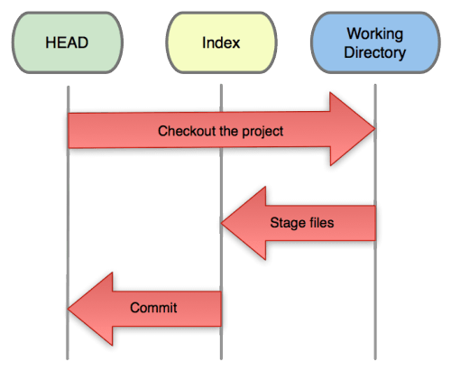

# git

## 1. 教程

* 官方教程
* [易百git教程](https://www.yiibai.com/git/)
* [git的reset和checkout的区别](https://segmentfault.com/a/1190000006185954)
* [代码回滚：git reset、git checkout和git revert区别和联系](https://www.cnblogs.com/houpeiyong/p/5890748.html)
* [Git 工具 - 重置揭密](https://git-scm.com/book/zh/v2/Git-%E5%B7%A5%E5%85%B7-%E9%87%8D%E7%BD%AE%E6%8F%AD%E5%AF%86)

## 2. 安装

```bash
# ius
yum install git2u
```

## 3. 知识

### 三个区域

1. HEAD 指向最近一次commit里的所有snapshot
2. Index 缓存区域，只有Index区域里的东西才可以被commit
3. Working Directory 用户操作区域



当你checkout分支的时候，git做了这么三件事情

1. 将HEAD指向那个分支的最后一次commit
2. 将HEAD指向的commit里所有文件的snapshot替换掉Index区域里原来的内容
3. 将Index区域里的内容填充到Working Directory里

所以你可以发现，HEAD、Index、Working Directory这个时候里的内容都是一模一样的。

**注意**：一般会误解为，Index中的内容是空的，只有git add后才会有东西。实际上不是，Index里一直是有东西的。

所以，Git的所有操作就是对这三个区域的状态（或内容）的操作。

### 撤销操作对三个区域影响

#### commit级别

| 操作 | Index暂存区 | workdir工作区 | 工作区安全 |
| --- | --- | --- | --- | --- |
|  reset --soft \[commit\] | 0 | 0 | 1 |
|  reset \[--mixed\] \[commit\] | 1 | 0 | 1 |
|  reset --hard \[commit\] | 1 | 1 | 0 |
|  checkout \[commit\] | 0 | 0 | 1 |

#### file级别

| 操作 | Index暂存区 | Workdir工作区 | 工作区安全 |
| --- | --- | --- |
|  reset \(commit\) \[file\] | 1 | 0 | 1 |
|  checkout \(commit\) \[file\] | 1 | 1 | 0 |

## 4. ss代理ssh

ss右键 -&gt; 允许来自局域网的连接。

安装connect-proxy

```bash
yum -y install connect-proxy
```

编辑 ~/.ssh/config 文件

```bash
# ~/.ssh/config

Host github.com *.github.com
    ProxyCommand connect-proxy -H 192.168.56.1:1080 %h %p
    IdentityFile ~/.ssh/id_rsa
    User git
```

## 5. 配置

### 配置文件


git config \[--global\|--system\] -e  打开对应配置文件进行编辑


| 命令 | 路径 | 描述 |
| --- | --- | --- | --- |
| git config | 当前项目目录 | 项目配置，作用于当前项目 |
| git config --global | ~/.gitconfig | 家目录，作用于当前用户 |
| git config --system | /etc/gitconfig | 全局配置 |

### 常用配置

| 描述 | 命令 |
| --- | --- | --- | --- | --- | --- | --- |
| 设置用户名 | git config user.name lixiaomeng |
| 设置邮箱 | git config user.email lixiaomeng8520@163.com |
| 忽略文件权限 | git config core.filemode false |
| 提交转换lf，检出不转换 | git config core.autocrlf input |
| 提交转换lf，检出转换crlf | git config core.autocrlf true |
| 提交检出均不转换 | git config core.autocrlf false |

## 6. 工作流


## 7. 命令

### branch

> 可以有多个远程仓库，本地分支可以设置不同仓库的远程分支。
>
> 本地分支的跟踪分支只有一个。

### pull

> 没有写本地分支的，都是指当前分支。
>
> 没有写远程分支的，则必须当前分支有跟踪的远程分支，否则会报错。

| 描述 | 命令 |
| --- | --- | --- | --- | --- |
| 完整形式 | git pull server remote\_branch:local\_branch |
| 与当前分支合并 | git pull server remote\_branch |
| 与当前分支合并（从**跟踪分支**） | git pull server |
| 与当前分支合并（从**跟踪分支**） | git pull |

### push

> 推送原则上要同名

| 描述 | 命令 |
| --- | --- | --- | --- | --- | --- |
| 完整形式 | git push server local\_branch:remote\_branch |
| 推送到同名分支，不存在则新建 | git push server local\_branch |
| 当前分支要和**跟踪分支**同名 | git push server |
| 当前分支要和**跟踪分支**同名 | git push |
| 删除远程分支 | git push server :remote\_branch |

### reset

> commit：将当前`HEAD`复位到指定状态，之后的提交销毁。已经push到远程仓库的 commit，不允许reset。

| 描述 | 命令 |
| --- | --- | --- | --- |
| 重设HEAD，缓存区，工作区 | git reset --hard \[HEAD\|commit\] |
| 重设HEAD，缓存区 | git reset --mixed \[HEAD\|commit\] |
| 重设HEAD | git reset --soft \[HEAD\|commit\] |

> file：将指定commit的文件同步到缓存区中。

| 描述 | 命令 |
| --- | --- |
| git reset \[HEAD^\] file.txt | 将文件加入缓存区（可以直接提交），如果是HEAD，则相当于unstage了。 |

### checkout

> commit：将HEAD移动到指定提交，更新缓存区和工作区，但是不会修改已经更改过的缓存区和工作区。

| 描述 | 命令 |
| --- | --- | --- |
| git checkout branch | 切换分支。 |
| git checkout HEAD^ | 切换到指定提交，会造成 HEAD分离。 |

> file：将指定commit的文件同步到缓存区和工作区。

| 描述 | 命令 |
| --- | --- |
| git checkout \[HEAD\|commt\] file.txt | 将指定commit的文件同步到缓存区和工作区。 |


